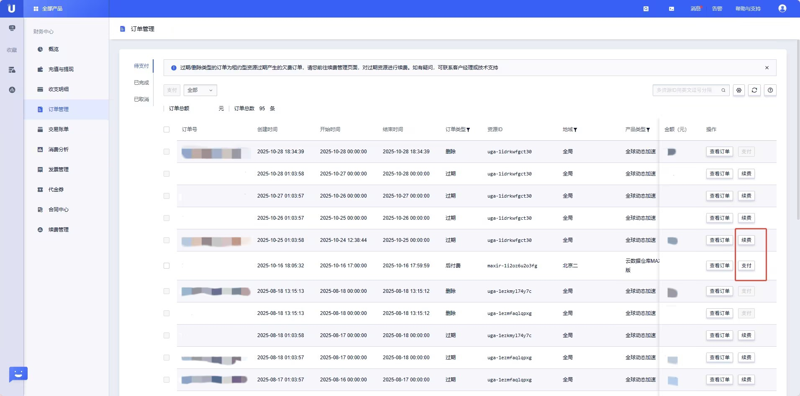

# 订单功能

登录优刻得官网控制台，选择 **财务中心 > 订单管理**，可以查看订单列表页面。订单管理分为3部分内容：待支付、已完成、已取消。

## 待支付页面

待支付页面存在的订单类型只有过期、删除、后付费3种类型。

用户可以在待支付页面对订单进行支付或续费。

1. **对于后付费资源**
   - 计费系统将根据您的实际使用量计费，若账户余额不足，生成后付费订单，您需先手动支付或者往账户充值金额，若未进行手动支付，系统会在每天5点自动完成支付。

2. **对于预付费资源**
   - 资源使用周期结束后，若产品接入回收系统并且账户余额不足以支付订单的情况下，该资源会进入回收阶段，具体规则参考 [自动续费](https://docs.ucloud.cn/renew/autorenew)。

   - 资源使用周期结束后，若产品未接入回收系统并且账户余额不足以支付订单的情况下，系统将生成到期订单（按天生成），您需手动续费或者往账户充值金额（若您开启自动续费，系统会为您自动完成续费，若您未开启自动续费，您需要手动完成续费）；若您选择不再使用并删除资源，系统将生成删除订单，此订单无需支付。

## 已完成页面

用户可以在已完成页面查看订单号、创建时间、订单类型、资源ID、金额等信息。

【说明】

1. **订单展示：**
   
   待支付订单默认展示所有订单，已完成和已取消订单默认展示本月订单。

2. **自定义列表：**
   
   账单列表右上角设置图表，可以自定义要展示的数据字段，定制成功后订单列表可展示相应数据。

3. **筛选条件：**
   - 账单月：单选，默认为当月
   - 资源ID：多个资源ID用英文逗号分隔

 4. **订单金额：**

   点击金额旁边的符号，可以查看金额的支付构成情况，订单金额=现金+赠金+代金券。

选择查看订单，查看订单详情页面。

- 在订单详情页面可以查看订单信息、资源信息、配置信息等。
  
  
## 已取消页面

用户购买或变更产品并完成支付后，若在后续确认环节选择取消而非确认，系统将自动退还已支付费用，并在当前页面按订单类型生成对应订单，订单状态为已取消。
